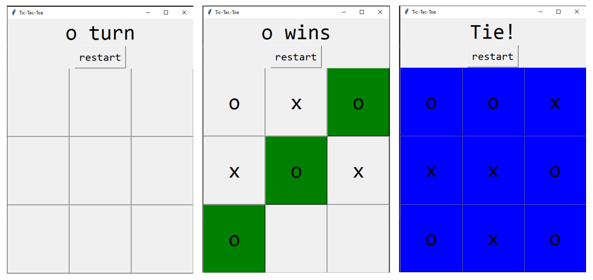

# Tic-Tac-Toe Game

This is a simple Tic-Tac-Toe game implemented in Python using the Tkinter library. The game allows two players to take turns and compete to win in a classic Tic-Tac-Toe match.



## Features

- Play a classic game of Tic-Tac-Toe with two players.
- Randomly selects the starting player.
- Announces the winner and a tie.
- Provides the option to start a new game.
- Flexibility to customize player symbols through the script (e.g., "x" and "o" is the default).

## Installation

To play the Tic-Tac-Toe game, simply run the `tic_tac_toe.py` script using Python.

## How It Works

- **Tkinter GUI**: The graphical user interface is created using the Tkinter library. It features a 3x3 grid of buttons where players can make their moves.

- **Player Selection**: The game randomly selects one of the players to start, and you can customize these symbols (e.g., "X" and "O").

- **Taking Turns**: Players take turns by clicking on an empty cell in the grid. The game checks for a winner or a tie after each move.

- **Winning Logic**: The game uses a simple algorithm to check for a win. If a player gets three of their symbols in a row (horizontally, vertically, or diagonally), they win, and the winning cells are highlighted in green.

- **Tie**: If all cells are filled and no player has won, the game ends in a tie, and the cells are highlighted in blue.

- **New Game**: You can start a new game at any time by clicking the "Restart" button.

## Custom Player Symbols

This game allows you to customize the player symbols. By default, it uses "X" and "O," but you can easily change them in the code to your preference.

## Project Files
- `tic_tac_toe.py`: The source code for the Tic-Tac-Toe game.
- `tic_tac_toe_screenshot.png`: A screenshot of the Tic-Tac-Toe game in action.

This Tic-Tac-Toe game served as a fun way to learn and practice basic Python programming skills. 

```python
players = ["x", "o"]  # Customize player symbols here
